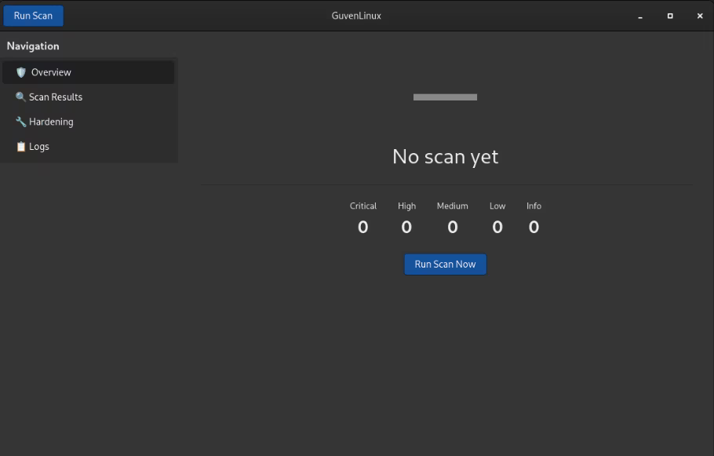
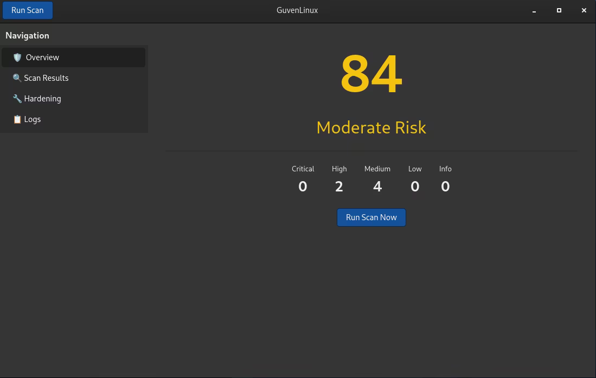
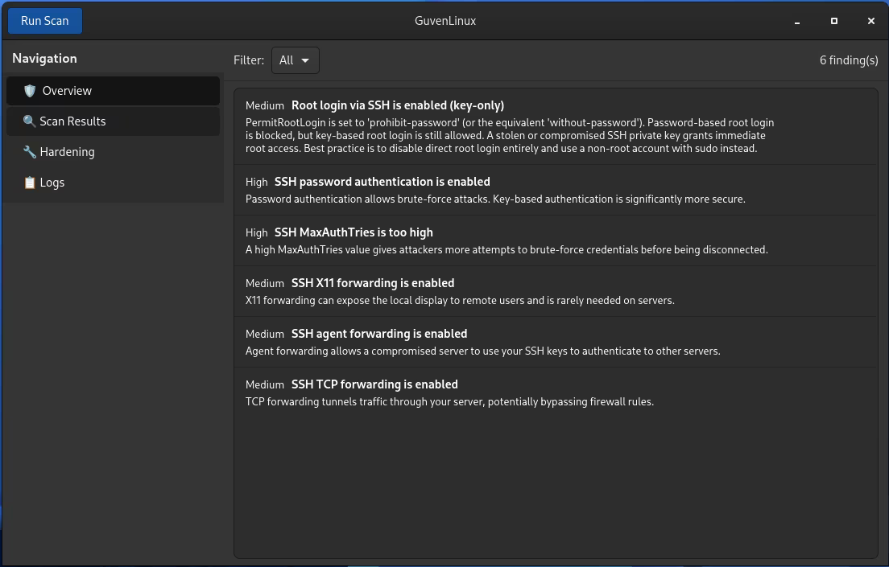
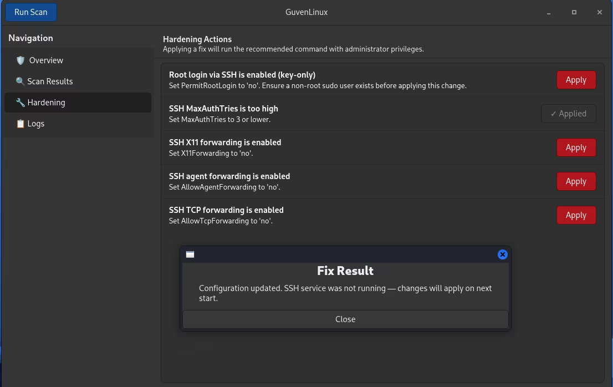
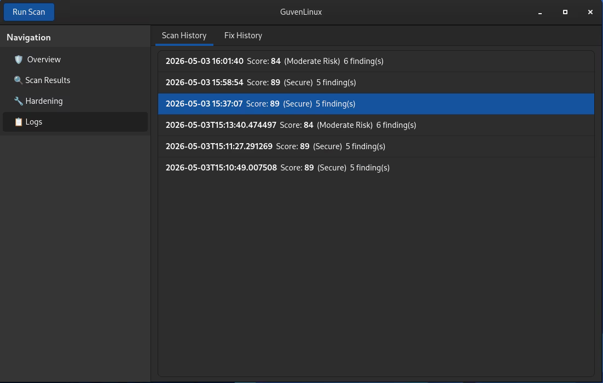

# GuvenLinux

**System Hardening & Security Assessment Tool for Linux (MVP)**

---

GuvenLinux is a Security assessment and System Hardening tool MVP that built to acquire a deep understanding of linux operating system security and the complete process of linux desktop app development 

## Features

- **Automated Security Scanning** — Six specialized scan engines covering ports, SSH, services, kernel hardening, file permissions, and user authentication
- **Risk Scoring** — Numeric score (0-100) with color-coded severity levels (Critical / High / Medium / Low / Info)
- **GTK4 Dashboard** — Modern graphical interface with 7 pages: Overview, Scan Results, Hardening Actions, Network View, Reports, Settings, and Logs
- **One-Click Hardening** — Apply recommended fixes automatically or step-by-step, all authenticated via PolicyKit
- **Report Export** — Full security reports in PDF and JSON formats
- **Audit Logging** — Every scan and fix action is logged for accountability

## Scan Engines

| Engine | Domain | Key Checks |
|--------|--------|------------|
| Port & Network Scanner | Network exposure | Open ports, listening services, dangerous ports |
| SSH Configuration Auditor | Remote access | PermitRootLogin, ciphers, MaxAuthTries |
| Service Auditor | Running services | Unnecessary services, root-context services |
| Kernel & OS Hardening | Kernel parameters | ASLR, SYN cookies, IP forwarding, core dumps |
| File Permission Auditor | Filesystem | SUID/SGID binaries, world-writable files, ownership |
| User & Authentication Auditor | User accounts | Empty passwords, UID 0 duplicates, sudoers |

## Requirements

- Debian-based Linux
- Python 3.10+
- GTK4 + PyGObject
- System tools: `ss`, `systemctl`, `nft`, `find`, `sysctl`

## Installation

```bash
git clone https://github.com/RoaaAlsham/GuvenLinux.git
cd GuvenLinux
pip install -r requirements.txt
python -m src.main
```

## Project Structure

```
GuvenLinux/
├── src/
│   ├── main.py                  # Entry point
│   ├── main_window.py           # GTK4 application window
│   ├── scan_runner.py           # Orchestrates all 6 engines
│   ├── risk_scorer.py           # Scoring & classification
│   ├── fix_engine.py            # Remediation executor
│   ├── action_registry.py       # Registry of all fix actions
│   ├── report_renderer.py       # PDF/JSON export
│   ├── log_manager.py           # Audit logging
│   ├── config_manager.py        # Settings persistence
│   ├── engines/
│   │   ├── port_scanner.py [implemented]
│   │   ├── ssh_auditor.py [implemented]
│   │   ├── service_auditor.py [implemented]
│   │   ├── kernel_hardening.py [pending]
│   │   ├── file_permission.py [pending]
│   │   └── user_auditor.py [pending]
│   └── ui/
│       ├── dashboard.py
│       ├── scan_results.py
│       ├── hardening_page.py
│       ├── network_view.py
│       ├── reports_page.py
│       ├── settings_page.py
│       └── logs_page.py
├── data/
│   ├── org.roaa.guvenlinux.policy
│   ├── guvenlinux.desktop
│   └── risk_weights.json
├── tests/
├── debian/
├── docs/
├── setup.py
├── requirements.txt
└── LICENSE
```

## Technology Stack

| Component | Technology |
|-----------|-----------|
| Language | Python 3.10+ |
| GUI | GTK4 + PyGObject |
| Privilege Escalation | PolicyKit + pkexec |
| Database | SQLite3 |
| Report Export | ReportLab (PDF) + JSON |
| Testing | pytest + pytest-cov |
| Packaging | debhelper + dh-python |
| CI/CD | GitHub Actions |

## Contributing

See [CONTRIBUTING.md](CONTRIBUTING.md) for guidelines on how to contribute.

## License

This project is licensed under the GNU General Public License v3.0 — see the [LICENSE](LICENSE) file for details.

## Example usecase





---

